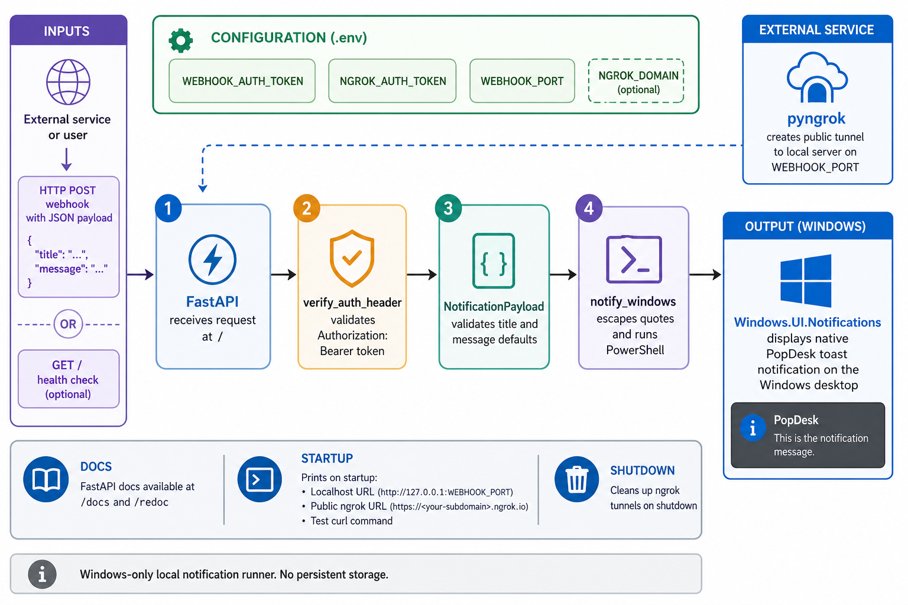

<div align="center">
  

  **🔔 Trigger Windows desktop notifications from anywhere via webhooks 🌐**
</div>

popdesk is a small FastAPI webhook server that turns authenticated HTTP requests into native Windows toast notifications.

Run it on a Windows desktop, let pyngrok publish the local server, then send a `POST /` request from a script, CI job, monitor, or any service that can call a webhook.

## Install

```bash
git clone https://github.com/tsilva/popdesk.git
cd popdesk
uv sync
cp .env.example .env
uv run python main.py
```

Edit `.env` before starting the server. When popdesk starts, it prints the local URL, public ngrok URL, and a ready-to-run test `curl` command.

## Commands

```bash
uv sync                  # install the locked Python environment
uv run python main.py    # start popdesk and open the ngrok tunnel
python -m venv venv      # optional manual environment path
pip install -r requirements.txt
python main.py
```

## Usage

Send a notification to the public ngrok URL printed at startup:

```bash
curl -X POST <public-ngrok-url> \
  -H "Authorization: Bearer <your-webhook-token>" \
  -H "Content-Type: application/json" \
  -d '{"title": "Build finished", "message": "The deployment job completed."}'
```

Endpoints:

| Method | Path | Auth | Purpose |
| --- | --- | --- | --- |
| `GET` | `/` | No | Health check |
| `POST` | `/` | Bearer token | Show a Windows toast notification |

The `POST /` payload accepts `title` and `message`. Both fields have defaults, so `{}` is valid.

## Notes

- Requires Python 3.10 or newer when using the `pyproject.toml`/`uv.lock` workflow.
- Requires Windows because notifications are sent through PowerShell and `Windows.UI.Notifications`.
- Requires `WEBHOOK_AUTH_TOKEN` and `NGROK_AUTH_TOKEN` in `.env`.
- Optional `.env` values are `WEBHOOK_PORT` and `NGROK_DOMAIN`.
- FastAPI docs are available locally at `/docs` and `/redoc` while the server is running.
- popdesk does not persist webhook payloads or notification history.

## Architecture



## License

[MIT](LICENSE)
